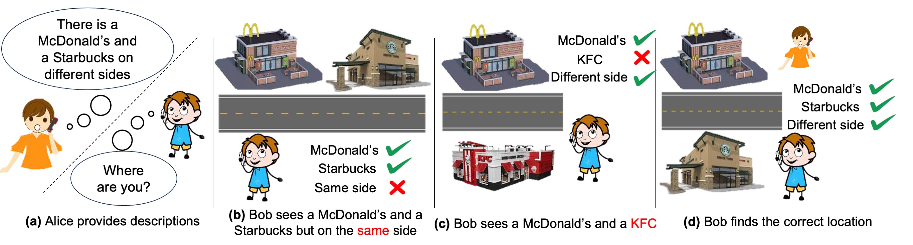
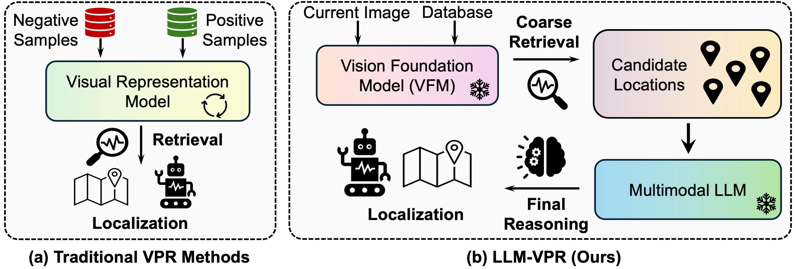

## *Tell Me Where You Are*: Multimodal LLMs Meet Place Recognition
[Zonglin Lyu](https://zonglinl.github.io/), [Juexiao Zhang](https://juexzz.github.io/), [Mingxuan Lu](https://scholar.google.com/citations?user=m4ChlREAAAAJ&hl=en), [Yiming Li](https://yimingli-page.github.io/), [Chen Feng](https://ai4ce.github.io/)



### Abstract

Large language models (LLMs) exhibit a variety of promising capabilities in robotics, 
including long-horizon planning and commonsense reasoning. 
However, their performance in place recognition is still underexplored. 
In this work, we introduce multimodal LLMs (MLLMs) to visual place recognition (VPR), 
where a robot must localize itself using visual observations. 
Our key design is to use *vision-based retrieval* to propose several candidates and then leverage *language-based reasoning*
to carefully inspect each candidate for a final decision. 
Specifically, we leverage the robust visual features produced by off-the-shelf vision foundation models (VFMs) to obtain several candidate locations. 
We then prompt an MLLM to describe the differences between the current observation and each candidate in a pairwise manner, 
and reason about the best candidate based on these descriptions.  Our method is termed **LLM-VPR**.
Results on three datasets demonstrate that integrating the *general-purpose visual features* from VFMs with the *reasoning capabilities* of MLLMs 
already provides an effective place recognition solution, *without any VPR-specific supervised training*. 
We believe LLM-VPR can inspire new possibilities for applying and designing foundation models, i.e. VFMs, LLMs, and MLLMs, 
to enhance the localization and navigation of mobile robots.



**🔍  Please check out [project website](https://ai4ce.github.io/LLM4VPR/) for more details.**

### Datasets

Please refer to [Anyloc](https://github.com/AnyLoc/AnyLoc) for dataset download. We included Baidu Mall, Pittsburgh30K, and Tokyo247.

### Vision Foundation Model

Please refer to [Anyloc](https://github.com/AnyLoc/AnyLoc) for Vision Foundation Model. We employed DINO-v2-GeM in their setup. 

Save your Coarse retrieval results as the followng structures:

```
└──── <working directory>/
    ├──── <data_name>/
    |   ├──── Query.png
    |   ├──── Top1_True/False.png
    |   ├──── ...
```
If the retrieval results is correct, the set is as True, otherwise False. This **does not** intend to tell MLLMs about the results. Instead, it is easier for you to compute whether MLLM imrpoves the performance or not. The True/False will be removed when they are fed to the MLLM.

### Try Vision-Language Refiner

Write your own api keys and change the directory of the saved data in ```main.py``` and run:

```
python main.py
```

This will generate .txt files with descriptions and reasonings. It will also provide the reranked Top-K by printing it to the terminal.
